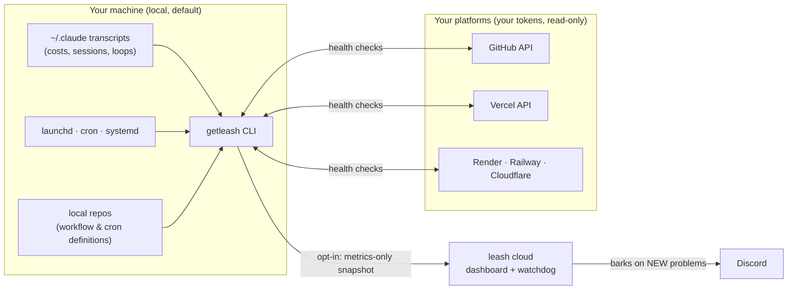

<div align="center">

# 🐕 leash

### See what your AI agents did last night.

One command. No signup. Costs, runaway loops, dead crons, failing workflows: your whole agent fleet, across every machine and cloud platform it runs on.

[](https://www.npmjs.com/package/getleash)
[](https://www.npmjs.com/package/getleash)
[](https://github.com/VicKayro/leash/actions/workflows/ci.yml)
[](LICENSE)
[](cli/package.json)

```
npx -y getleash
```

[**Live demo fleet →**](https://getleash.vercel.app/f/flt_cafebabe00decafbad00face) · [Quick start](#quick-start) · [Dashboard](#the-fleet-dashboard) · [Watchdog](#-watchdog) · [Privacy](#privacy) · [FAQ](#faq)

</div>

---

<p align="center"></p>

## Why

You run agents now. Claude Code sessions that work for hours, launchd and cron jobs, GitHub Actions on a schedule, Vercel crons. They ship while you sleep. They also **die silently, loop on the same tool call at 3am, and burn API budget** while you sleep. Nothing watches them.

leash is the missing pane of glass: what your agents did, what it was worth, what broke, and the exact command to fix it. Local-first, metrics-only, one `npx` away.

## Quick start

```
npx -y getleash
```

Ten seconds later you have:

- **The value of the work**: pay-as-you-go API value of your last 30 days, per project, with the multiple vs your flat subscription ("9.8× a $200/mo Max")
- **Every scheduled agent on the machine** (launchd, cron, systemd): zombies pointing at deleted scripts, jobs that stopped writing logs, last runs that crashed
- **Every cloud agent, checked live**: GitHub Actions and Vercel crons verified with the logins already on your machine (see [platforms](#live-platform-checks))
- **Runaway loops**: the same tool call repeated 10+ times with identical input, priced
- **Fixes**: each problem comes with a copy-paste command, not a shrug
- Press **Enter** at the end and the whole thing becomes a live dashboard (optional, free)

Nothing leaves the machine unless you say so. `--json` for scripts, `--days N` for the window, `--offline` to skip every network call.

## The fleet dashboard

<p align="center"></p>

**[→ Open the live demo fleet](https://getleash.vercel.app/f/flt_cafebabe00decafbad00face)** (three machines, real layout, curated data)

`npx getleash connect` gives you a private URL. No account, no email: the URL is the key. Every machine you connect with the same fleet token lands on the same page, and a `SessionEnd` hook refreshes it after each Claude Code session.

- **Hero**: what your agents did, in dollars, with the subscription ROI multiple
- **🌙 While you slept**: a midnight-to-7am timeline per night, each session placed at the hour it actually ran
- **The pulse**: 30 days of cost, day by day
- **Your fleet**: one health dot per agent, problems first
- **Needs attention**: severity, machine, cause, and where to get the fix

## Live platform checks

Agents don't just live on your laptop. leash checks the platforms where they run, with credentials that never leave your machine and never go to leash:

| Platform | Setup | What gets checked |
|---|---|---|
| **GitHub Actions** | none: uses your `gh` login or `GITHUB_TOKEN` | last run status, disabled workflows, schedules GitHub silently stopped firing |
| **Vercel** | none: uses your `vercel` login or `VERCEL_TOKEN` | every cron across all projects and teams, enabled/disabled, failed deployments |
| **Render** | `getleash link render <api-key>` | cron jobs: suspended, stale, last successful run |
| **Railway** | `getleash link railway <token>` | scheduled services, latest deployment status |
| **Cloudflare Workers** | `getleash link cloudflare <api-token>` | workers with cron triggers |

`npx getleash link` shows what's connected. Tokens are validated before saving, stored in `~/.leash/providers.json` (chmod 600), and only ever sent to their own platform's API, read-only.

## The budget guard

Claude Code has **no native spend limit**. leash gives you a hard one, in one command:

```
npx getleash guard --daily 25 --hourly 5
```

A `PreToolUse` hook estimates your spend from local transcripts (cached 2 min) and **blocks tool calls** past the cap, with a clear message. The hourly cap is the loop killer: it stops a runaway session in about two minutes, long before the daily cap would. Fail-open by design: if anything breaks, Claude Code works normally. `--status` to check, `--off` to remove, backup of your settings kept at `settings.json.pre-leash`.

## The live monitor

```
npx getleash watch
```

`top` for your agents: sessions running right now, cost ticking per session, current tool call, burn rate in $/h. Refreshes every 2 seconds.

## 🐕 Watchdog

A dashboard has to be looked at. **The watchdog barks.**

Every push is diffed against the machine's previous one. The moment something **new** breaks (a cron goes zombie, a workflow starts failing, a loop fires at 3am) it pings your Discord channel with what broke and a link to the fleet. Known problems stay quiet: no alert fatigue.

```
npx getleash watchdog --discord <your-webhook-url>
```

(Discord → channel settings → Integrations → Webhooks → New Webhook. It proves the webhook with a test ping before saving anything.)

## Pricing

There isn't any. Report, live monitor, budget guard, fleet dashboard, night replay, platform checks, watchdog: **all of it is free and open source.** If it saves your fleet one 3am loop, [a star](https://github.com/VicKayro/leash) is the price.

## How it works



- **Cost accuracy**: usage is deduplicated by `message.id + requestId` (retries and resumed sessions would otherwise double-count), priced per model generation, within ~5% of `ccusage`.
- **Loop detection**: same tool + identical input hash, 10+ times overall or 6+ within ten minutes.
- **Cloud health**: workflow state plus last run from the platform's own API; "stale" is inferred from the cron expression (GitHub silently stops scheduling inactive repos).
- **The gate**: the budget guard is a `PreToolUse` hook; exit 2 blocks the call. It cannot be bypassed by permission modes.

## Privacy

The local scan makes **zero network calls** (`--offline` guarantees it even with platforms linked). Everything else is opt-in and metrics-only:

| Leaves the machine (only after you connect) | Never leaves, ever |
|---|---|
| Costs, session counts, tool-call counts | Prompts and transcript content |
| Project display names, agent labels | File paths and file contents |
| Health statuses and schedules | Platform tokens (they go to their own platform only) |

An end-to-end test asserts the snapshot contains no home paths and no absolute paths. The dashboard URL is a capability: treat it like a secret, `connect --off` kills it locally and removes the hook.

## FAQ

<details>
<summary><b>I've never used a terminal. Can I still use this?</b></summary>

Yes. Open the **Terminal** app (macOS: Cmd+Space, type "Terminal"), paste `npx -y getleash`, press Enter. The report explains itself, and every problem comes with the exact command to copy and paste. Nothing is installed permanently.
</details>

<details>
<summary><b>Does it only work with Claude Code?</b></summary>

The cost and session analysis reads Claude Code's local transcripts today. The scheduled-agent scan (launchd, cron, systemd) and the platform checks (GitHub, Vercel, Render, Railway, Cloudflare) watch **any** agent, whatever wrote it. Multi-LLM cost parsing is on the roadmap.
</details>

<details>
<summary><b>How accurate are the dollar amounts?</b></summary>

Within about 5% of `ccusage`. Usage is deduplicated by `(message.id, requestId)` so streaming, retries and resumed sessions are counted once, and priced per model generation, including cache-write tiers. On a subscription, the number is what your usage would cost pay-as-you-go: your ROI, not a bill.
</details>

<details>
<summary><b>What if someone gets my dashboard URL?</b></summary>

They see metrics: project names, costs, agent health. Never prompts, paths or contents. Rotate by disconnecting (`connect --off`) and reconnecting for a fresh token.
</details>

<details>
<summary><b>Why is the package called <code>getleash</code> and not <code>leash</code>?</b></summary>

`leash` on npm is an abandoned MongoDB package from 2012. We asked; the squatters were faster. `npx getleash` it is.
</details>

## Development

```
cd cli && npm install && npm test     # build + 21 tests, all offline
```

TypeScript, esbuild single-file bundle, **zero runtime dependencies**. The cloud is three Vercel functions and a static page over Vercel Blob; its alert engine has its own integration harness (`cloud/test/watchdog-harness.mjs`). See [CONTRIBUTING.md](CONTRIBUTING.md).

## License

[MIT](LICENSE). Built in the open, fast: see the [CHANGELOG](CHANGELOG.md) for the day-by-day story.
